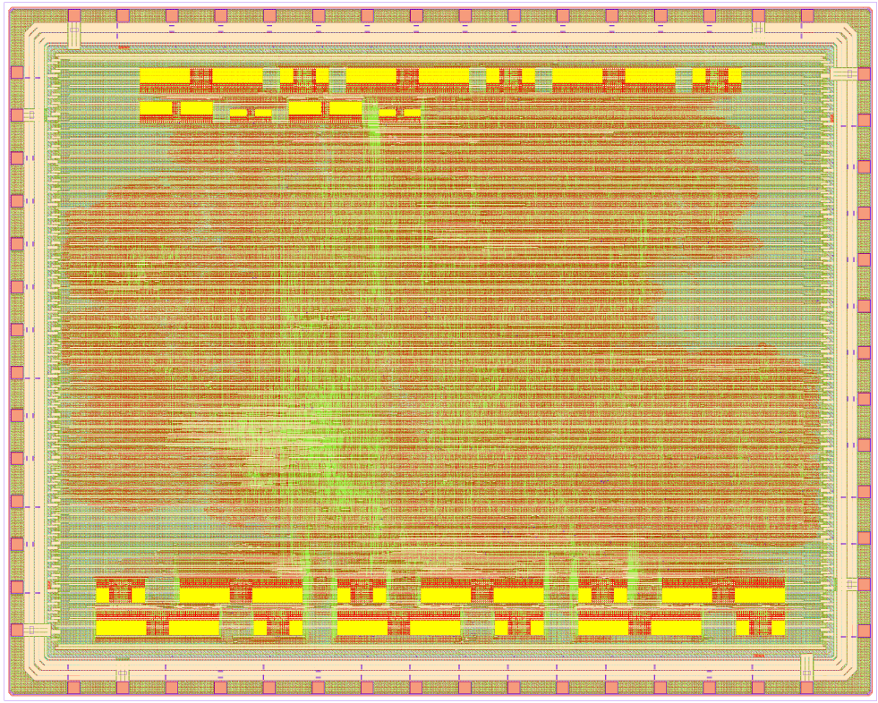

# TAICHIP-1 SoC (FURIES)

TAICHIP-1 SoC (FURIES) is a RISC-V-based AI SoC platform built on the open-source CROC SoC from ETHZ. The platform features a CVE2 RISC-V core, DNN accelerator (FORTALESA), on-chip memory, DMA, JTAG, UART, SPI, and GPIO.

FORTALESA is a systolic array architecture with three execution modes for run-time reconfigurable redundancy and a flexible reliability–performance trade-off. FORTALESA is based on the output-stationary systolic array that allows to multiply matrices of size NxM and MxN, where N is the size of the systolic array and M is defined by the length of the buffer.

The platform features multiple fault tolerance features, including dual-lockstep for RISC-V core, fault tolerant OBI bus infrastructure, ECC on memories, reconfigurable redundancy for FORTALESA accelerator, and MBIST.

The SoC is developed within the [TAICHIP](https://taichip.taltech.ee/) project (Boosting TalTech Capacity in Reliable and Efficient AI-Chip Design). The name FURIES comes from the opening lines of the poem [Reflection](https://www.poeticous.com/r-s-thomas/reflections) by R.S. Thomas (_"The furies are at home in the mirror; it is their address."_) quoted in [Disco Elysium](https://en.wikipedia.org/wiki/Disco_Elysium).

The chip was designed with open source EDA tools and the [IHP Open Source PDK SG13CMOS5L](https://github.com/IHP-GmbH/ihp-sg13cmos5l).

<p align="center">
  <a href="doc/img/taichip_soc_layout.png">
    
  </a>
</p>

## Chip Overview

The architecture of the TAICHIP-1 SoC platform is given below. Fault-tolerance (FT) features are marked with pink boxes.

The size of the FORTALESA systolic array is set to 12×12. The chip features 2 256×32 SRAM blocks for instruction and data memory and 3 dedicated accelerator buffers: for activations, weights and outputs. Each buffer consists of 3 dual-port 256×32 SRAM blocks; one port is connected to the OBI bus interface, another port is connected directly to the accelerator. This way, every clock cycle systolic array can read 96+96b from activations and weights buffers and write 96b to the output buffer. Additionally, for every SRAM block, there is a 256×8 SRAM for keeping ECC (not shown on the figure below).

**Fault-tolerance and DFT features overview**
- Dual-lockstep for RISC-V core. The feature is always on. In case of mismatch, an alert is triggered.
- Fault tolerant OBI bus infrastructure, including ECC-encoded data and TMR for addressing logic.
- ECC for all SRAM blocks. ECC is always on.
- FORTALESA systolic array supports reconfigurable redundancy (see more detailes below).
- MBIST (see more details below).

The final size of the chip (including sealring) is 5000×4000 μm<sup>2</sup>.


## Memory Map

This is the memory map of the chip:

| Start Address   | Stop Address    | Description                  |
| --------------- | --------------- | ---------------------------- |
| `32'h0000_0000` | `32'h0004_0000` | Debug module (JTAG)          |
| `32'h0300_0000` | `32'h0300_1000` | SoC control/info registers   |
| `32'h0300_2000` | `32'h0300_3000` | UART peripheral              |
| `32'h0300_5000` | `32'h0300_6000` | GPIO peripheral              |
| `32'h0300_A000` | `32'h0300_B000` | Timer peripheral             |
| `32'h0300_C000` | `32'h0300_D000` | SPI peripheral               |
| `32'h0400_0000` | `32'h0400_1000` | FORTALESA configuration      |
| `32'h1000_0000` | `+SRAM_SIZE`    | Memory banks (SRAM)          |
| `32'h5000_0000` | `32'h5000_1000` | DMA configuration            |

## Bootmodes

Currently, the only way to boot the system is via JTAG.

## FORTALESA

FORTALESA is a systolic array architecture with three execution modes for run-time reconfigurable redundancy and a flexible reliability–performance trade-off.

FORTALESA supports three execution modes:
1. performance with no redundancy;
2. dual-redundancy grouping (DRG) for reliability–performance trade-off;
3. triple-redundancy grouping (TRG) for full protection.

It is used to enhance the reliability of DNN inference on a systolic array through the heterogeneous mapping of different network layers to different execution modes. Since different layers of DNNs have different vulnerability levels, it is possible to execute them in different modes, thus achieving an efficient trade-off between performance and reliability.

Systolic array features 8-bit multipliers and 32-bit accumulators, however, outputs are scaled to 8 bits before writing to the memory. 32-bit scale value in fixed-point format should be set before the tile multiplication.

FORTALESA is set up through configuration registers:

| Offset | Description                 | Comment                                      |
| ------ | --------------------------- | -------------------------------------------- |
| `0x00` | Execution mode              | Performance - `00`, DRG - `01`, TRG - `11`   |
| `0x04` | Matrix tile length          | Should be less than the buffer size (256)    |
| `0x08` | Scale value for the outputs | 32-bit fixed-point value                     |
| `0x0C` | Start/status                | Status = 1 means busy, status = 0 means idle |
| `0x10` | Error register              | Incorrect mode or tile length                |

Matrix tile length, execution mode and scale value can only be set when the systolic array is idle (`status = 0`). Systolic array execution is started by writing 1 to the start register, reading from the same address returns the status.

## MBIST

The chip has 5 pins dedicated to MBIST: `mbist_start_i`, `mbist_watch_i`, `mbist_active_o`, `mbist_all_done_o`, `mbist_any_done_o`. MBIST is enabled by sending 1 through the `mbist_start_i` pin. `mbist_active_o` signal shows the status. Each SRAM block has a dedicated MBIST module that work in parallel, therefore, `mbist_all_done_o` and `mbist_any_done_o` show that all MBIST modules are done and that any is done (for additional fault tolerance). When `mbist_watch_i` is set to 1, the result of the test is sent to GPIO pins: one bit per SRAM block showing whether there were errors (`0`) in that block or not (`1`). In case of an error, address of the faulty word can be found using software test.

During MBIST, ECC decoder is disabled.

## Status Signals

The chip has 5 pins for error signals. `lockstep_error_o` reports mismatch in the dual-lockstep. 2-bit `obi_error_o` reports errors in the OBI bus infrastructure ([0] - single-bit error, [1] - multi-bit error). 2-bit `mem_error_o` reports ECC errors in memories ([0] - single-bit error, [1] - multi-bit error).

## Simulation

See `tb/fortalesa_top_tb.sv` for the full chip simulation. To simulate with QuestaSim, run `make vsim`.

## Building the Chip

The chip is built using Yosys and OpenRoad. The workflow is based on the [scripts from ETH Zurich](https://github.com/pulp-platform/croc). Metal density fill is performed using Klayout, however, multiple iterations of the filler script from IHP with different values are required to pass density rules. NOTE: those iterations are not included in the Makefile steps.

Note that SG13CMOS5L PDK relies heavily on SG13G2 PDK (using file links), therefore, both PDKs should be downloaded to the `ihp13\` folder.

The [IIC-OSIC-Tools](https://github.com/iic-jku/IIC-OSIC-TOOLS) docker container was used for generating the layout (version 2026.06).

To generate the layout, run:

```
make yosys
make openroad
make gds
make sealring
make fill
make drc
make drc-density
```

## Contributors

- Natalia Cherezova (TalTech)
- Abdelmadjid Dahmani (TalTech)
- Ashwin Santhosh (TalTech)
- Andre Lucas Chinazzo (IHP)

## Publication

FORTALESA design is based on the paper:

```
@article{FORTALESA,
  title = {{FORTALESA:} Fault-Tolerant Reconfigurable Systolic Array for {DNN} Inference}, 
  author = {Natalia Cherezova and Artur Jutman and Maksim Jenihhin},
  journal = {Microprocessors and Microsystems},
  year = {2025},
  pages = {105222},
  issn = {0141-9331},
  doi = {https://doi.org/10.1016/j.micpro.2025.105222},
}
```
